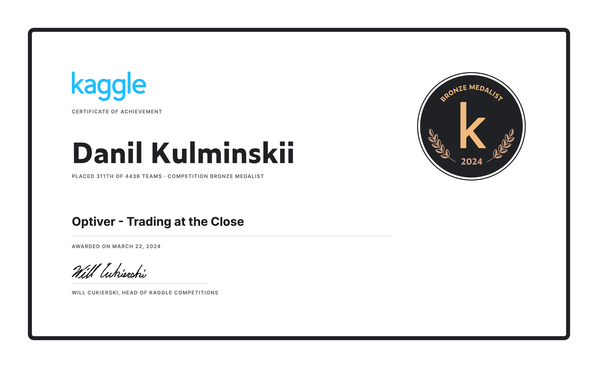

# optiver-2023

This solution earned a bronze medal in the competition **"Optiver - Trading at the Close."** This is a clean refactored version for demonstration purposes.



## Reproducing the Solution

To reproduce the solution:
1. Install the required dependencies:
    ```sh
    pip install -r requirements.txt
    ```
1. Place your Kaggle credentials in `kaggle.json`.
2. Tune hyperparameters using Optuna. The configuration file is located at configs/optuna.json.
    ```sh
    python scripts/train.py
    ```
1. View the tuning results using the MLflow UI:
    ```sh
    mlflow ui
    ```
1. Copy the best parameters and run the training. The configuration file is located at `configs/model.json`.
    ```sh
    python scripts/train.py
    ```
1. Generate the submission. The result will be saved in `data/submissions`.
    ```sh
    python scripts/generate_submission.py
    ```

Special thanks to [Alex Wang](https://www.kaggle.com/peizhengwang) for developing the feature processing pipeline that served as the foundation for this solution.
